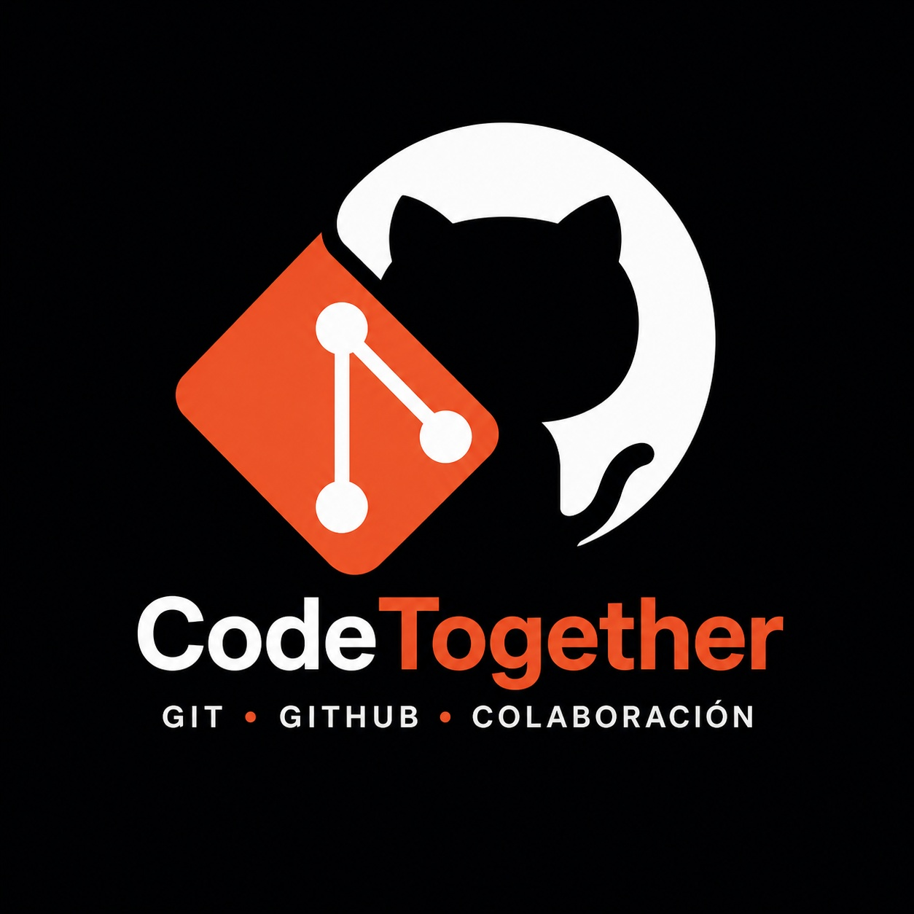

### Logo


## Integrantes

### Ignacio Alex Escobar Vasquez

- 📧 alexvasquez17dev@gmail.com
- 📱 72781371

### Jhoel Rodrigo Alata Cruz

- 📧 alatajhoelrodrigo@gmail.com
- 📱 63645865

### Ariana Camila Fernández Rios

- 📧 camifer802@gmail.com
- 📱 62633166

### Gabriel Jhoan Cespedes Garcia

- 📧 202401173@est.umss.edu
- 📱 67438391


# 🚀 Proyecto Grupal: GitHub Clases

## 📌 Descripción

Este proyecto consiste en una página web educativa desarrollada en equipo para reforzar el aprendizaje de **Git, GitHub y GitFlow**.
Incluye contenido interactivo como buscador de apuntes, filtros y seguimiento de progreso.

---

## 🧩 Tecnologías utilizadas

* HTML5
* CSS3
* JavaScript (ES Modules)
* Git & GitHub

---

## 📁 Estructura del proyecto

```
Proyecto-Grupal/
│
├── index.html
├── css/
│   └── styles.css
├── js/
│   └── main.js
```

---

## ⚙️ Requisitos

* Navegador web moderno (Chrome, Firefox, Edge)
* (Opcional) Python 3 para servidor local

---

## ▶️ Ejecución del proyecto

### 🔹 Opción 1: Ejecución rápida

1. Clonar el repositorio:

   ```
   git clone https://github.com/tu-usuario/Proyecto-Grupal.git
   ```
2. Ingresar al directorio:

   ```
   cd Proyecto-Grupal
   ```
3. Abrir el archivo `index.html` con doble clic o:

   ```
   xdg-open index.html
   ```

---

### 🔹 Opción 2: Ejecución recomendada (servidor local)

Para asegurar el correcto funcionamiento de JavaScript:

1. Clonar el repositorio:

   ```
   git clone https://github.com/tu-usuario/Proyecto-Grupal.git
   ```
2. Ingresar al directorio:

   ```
   cd Proyecto-Grupal
   ```
3. Iniciar servidor local:

   ```
   python3 -m http.server
   ```
4. Abrir en navegador:

   ```
   http://localhost:8000
   ```

---

##  Funcionalidades a verificar

El sistema permite:

###  Navegación

* Menú superior funcional
* Desplazamiento entre secciones

###  Sección de apuntes

* Buscador dinámico
* Filtros por categoría
* Visualización de tarjetas

###  Interactividad

* Barra de progreso
* Botón “volver arriba”
* Actualización dinámica del contenido

###  Diseño

* Estilo moderno (negro y naranja)
* Distribución responsive

---

##  Flujo de trabajo (GitFlow)

El desarrollo se realizó mediante:

* Ramas `feature/*` para cada integrante
* Integración en `develop` mediante Pull Requests
* Revisión y aprobación de cambios
* Creación de rama `release`
* Versión final integrada en `main`

---

##  Equipo de trabajo

* Ignacio Alex
* Alata
* Camila
* Gabriel Jhoan

---

##  Notas adicionales

* El proyecto es una aplicación web estática (no requiere backend)
* Se recomienda ejecutar con servidor local para evitar problemas con módulos JavaScript

##  Estado del proyecto

✔️ Finalizado
✔️ Funcional
✔️ Listo para evaluación

---
